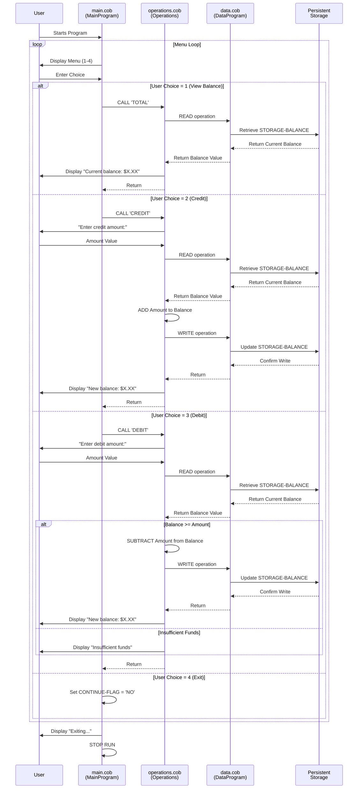

# Student Account Management System - COBOL Documentation

## Overview

This directory documents the legacy COBOL-based Student Account Management System, a three-tier application that manages student account balances, credits, and debits. The system is built using modular COBOL programs that interact through a menu-driven interface.

---

## COBOL Programs

### 1. **main.cob** (MainProgram)

**Purpose:** Entry point and menu controller for the Account Management System.

**Key Functions:**
- Displays an interactive menu with four options:
  1. **View Balance** - Retrieves and displays current account balance
  2. **Credit Account** - Adds funds to the account
  3. **Debit Account** - Withdraws funds from the account
  4. **Exit** - Terminates the program
- Implements a loop that continues until the user selects "Exit"
- Routes user selections to the Operations program with appropriate operation codes

**Program Flow:**
```
Display Menu → Accept User Input → Evaluate Choice → Call Operations (or Exit)
```

---

### 2. **data.cob** (DataProgram)

**Purpose:** Data persistence layer that manages student account storage and retrieval.

**Key Functions:**
- **READ Operation:** Retrieves the current account balance from persistent storage
- **WRITE Operation:** Updates and persists the account balance to storage
- Acts as an abstraction layer for account balance data management

**Key Variables:**
- `STORAGE-BALANCE` - Persistent storage of account balance (initial value: 1000.00)
- `OPERATION-TYPE` - Determines whether to READ or WRITE
- `PASSED-OPERATION` - Operation parameter passed from calling programs
- `BALANCE` - The balance value being read or written

**Data Format:**
- Numeric field: PIC 9(6)V99 (6 digits before decimal, 2 digits after)
- Example: 001000.00 (one thousand dollars)

---

### 3. **operations.cob** (Operations)

**Purpose:** Business logic handler that executes account transactions and enforces business rules.

**Key Functions:**

#### TOTAL Operation
- **Function:** View current account balance
- **Process:** Calls DataProgram with READ operation
- **Output:** Displays current balance to the user

#### CREDIT Operation
- **Function:** Add funds to the student account
- **Process:**
  1. Prompts user for credit amount
  2. Reads current balance from storage
  3. Adds the amount to the balance
  4. Writes updated balance to storage
  5. Displays new balance to the user
- **Business Rule:** No limit checking; any positive amount can be credited

#### DEBIT Operation
- **Function:** Withdraw funds from the student account
- **Process:**
  1. Prompts user for debit amount
  2. Reads current balance from storage
  3. Validates that balance is sufficient (key business rule)
  4. If sufficient funds exist:
     - Subtracts amount from balance
     - Writes updated balance to storage
     - Displays new balance to the user
  5. If insufficient funds:
     - Displays error message
     - Does NOT modify the balance

---

## Business Rules - Student Account Management

### 1. **Initial Account Balance**
- Default starting balance for new student accounts: **$1,000.00**
- This value is hardcoded in the DataProgram

### 2. **Credit Operations**
- Students can credit (add) funds to their accounts at any time
- There is no upper limit on account balance
- Credits are immediately recorded and persisted

### 3. **Debit Operations (Key Rule)**
- **Overdraft Prevention:** Students cannot debit more than their current account balance
- System validates `FINAL-BALANCE >= AMOUNT` before processing debit
- If a debit would result in negative balance, the transaction is **rejected**
- Insufficient funds error message is displayed to the user
- Original balance remains unchanged if debit is rejected

### 4. **Data Persistence**
- All balance updates are immediately written to persistent storage via DataProgram
- Balance state is maintained between program executions
- No intermediate transactions are lost

### 5. **Account Type**
- The system manages generic "student accounts"
- Each invocation of the application manages a single student's account
- No multi-account or user authentication features in the current implementation

---

## System Architecture

```
┌─────────────────────────────────────┐
│  main.cob (MainProgram)             │
│  - User Interface/Menu Controller    │
└──────────────┬──────────────────────┘
               │
               │ Calls with operation type
               ▼
┌─────────────────────────────────────┐
│  operations.cob (Operations)        │
│  - Business Logic & Validation      │
│  - Credit/Debit Processing          │
└──────────────┬──────────────────────┘
               │
               │ Reads/Writes balance data
               ▼
┌─────────────────────────────────────┐
│  data.cob (DataProgram)             │
│  - Data Storage & Retrieval         │
│  - Persistent Balance Storage       │
└─────────────────────────────────────┘
```

---

## Modernization Considerations

This system represents legacy COBOL code that may benefit from modernization:

- **Language Migration:** Consider translating to modern languages (Java, Python, etc.)
- **Database Migration:** Move from in-memory storage to proper database systems
- **API Services:** Expose functionality through REST/GraphQL endpoints
- **Error Handling:** Enhance error handling and validation beyond balance checks
- **Concurrency:** Add support for concurrent user access
- **Audit Trail:** Implement transaction logging and audit capabilities
- **Security:** Add authentication, authorization, and encryption
- **Testing:** Establish unit and integration testing frameworks

---

## File Location

- **main.cob** - `/src/cobol/main.cob`
- **data.cob** - `/src/cobol/data.cob`
- **operations.cob** - `/src/cobol/operations.cob`

---

## Data Flow Sequence Diagram



### Sequence Diagram Explanation

The diagram illustrates the complete data flow through the application:

1. **User Interaction** - User starts the program and repeatedly selects menu options
2. **Menu Loop** - MainProgram displays the menu and evaluates user choices
3. **VIEW BALANCE Path** - Reads current balance from storage via DataProgram
4. **CREDIT Path** - Accepts amount, reads current balance, adds amount, writes updated balance back to storage
5. **DEBIT Path** - Accepts amount, reads balance, validates sufficient funds, then either:
   - Subtracts and writes back (if funds sufficient), or
   - Rejects transaction (if insufficient funds)
6. **EXIT Path** - Terminates the program loop and exits

The key validation occurs in the DEBIT path where the system ensures `FINAL-BALANCE >= AMOUNT` before allowing the transaction to proceed.

---

*Last Updated: February 2026*
